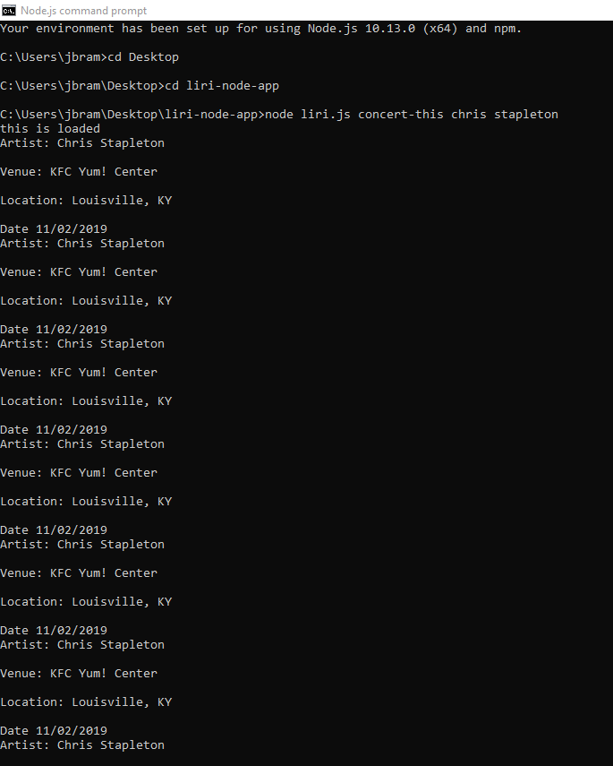
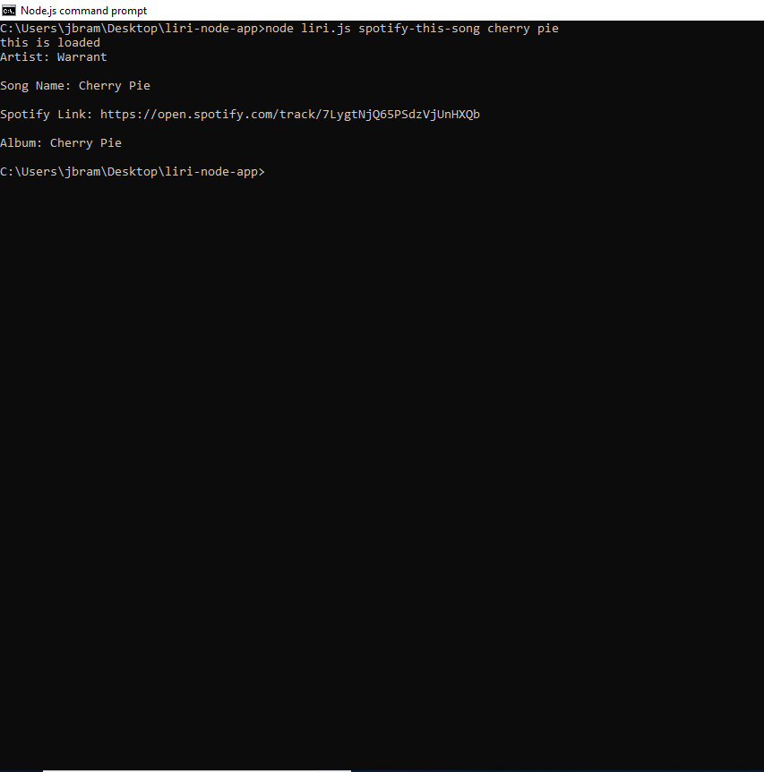
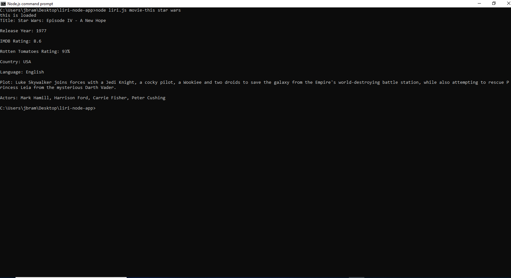
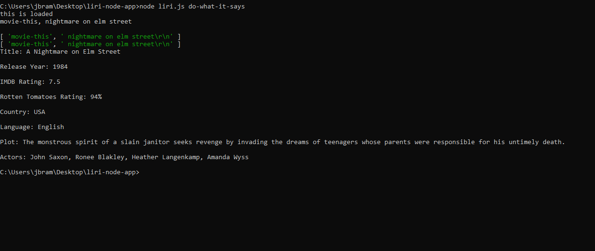

# Liri-Node-App

## Overview

LIRI (Language Interpretation and Recognition Interface), takes in user inputs to search for data from the Bands in Town API, Spotify API, and OMDB, and displays results in the command line using node.js.

### Instructions

github.com/jbramble18/Liri-Node-App/git

The user will search for data using one of four commands.

1. Search Bands in Town for concerts 
    * User will utilize this syntax to search - **node liri.js concert-this *[name of artist searching for]* **

    

2. Search for song on Spotify
    * User will utilize this syntax to search - **node liri.js spotify-this-song *[name of song searching for]* **
    
    If no search term is entered, the program will default to give information about "The Sign" by Ace of Base

    

3. Search for movie on OMBDB
    * User will utilize this syntax to search - **node liri.js movie-this *[name of movie searching for]* **
    
    If no search term is entered, the program will default to give information about "Mr. Nobody"

    

4. Run a random command
    * User will utilize this syntax to search - **node liri.js do-what-it-says**

    
    
    
